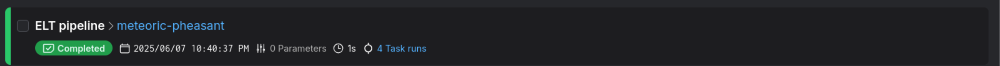
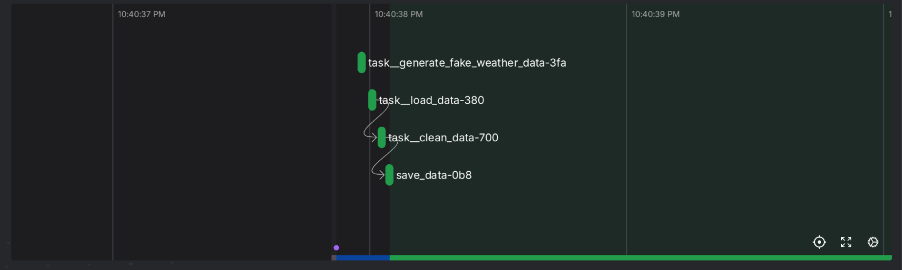
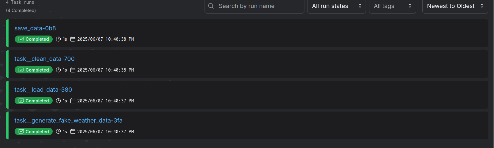

## How to guide
### 1. Set up
- Export ROOT_DIR environment variable:
   ```bash
   export ROOT_DIR=$(pwd)
   ```
- Install venv inside the project folder:
   ```bash
   conda create --prefix venv python=3.11.9
   conda activate $ROOT_DIR/venv
   ```
- Install dependencies:
   ```bash
    pip install -r requirements.txt
    ```
- Install prefect:
    ```bash
    docker compose -f compose-prefect.yml up -d
    ```
- Set Prefect server URL:
    ```bash
    prefect config set PREFECT_API_URL=http://127.0.0.1:4200/api
    ```

### 2. Run the simple ETL pipeline
- Run the project:
    ```bash
    python main.py
    ```
- Check the Prefect UI at `http://127.0.0.1:4200`
    - The last run
    
    - Lineage
    
    - Task run details
    